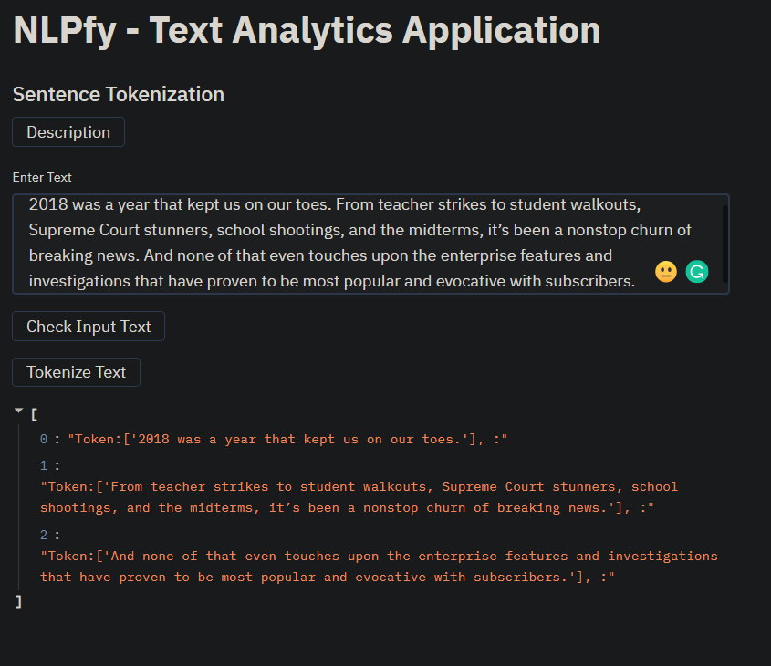
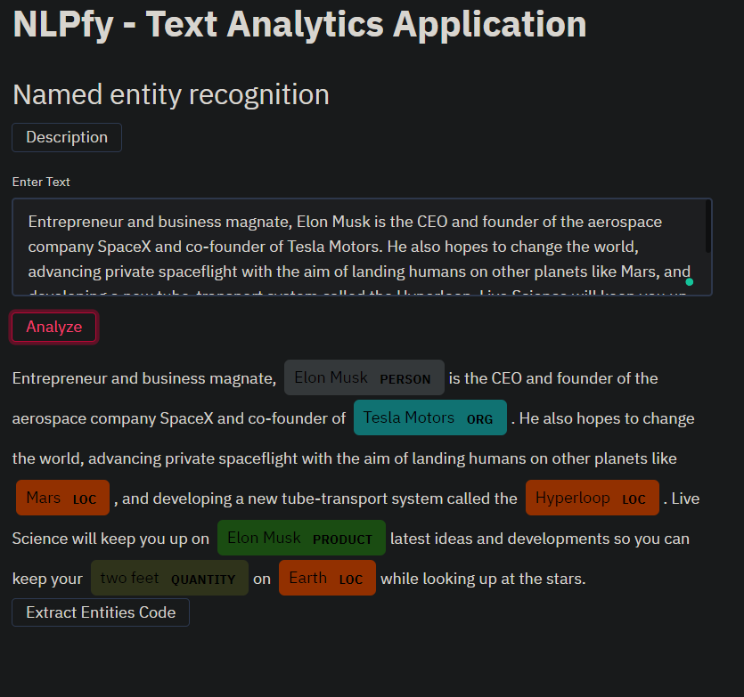
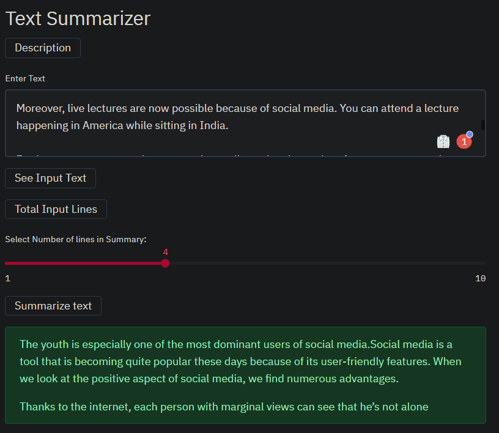

# ML Toolkit

Text Analytics Web Application which preforms various tasks which include - 
* Sentence Tokenisation
* Word Tokenisation and Stemming
* Sentiment Analysis
* Text Summarizer
* NER checker (Text + URLs)

### Install the follwing dependencies in a new virtual enviroment to run the application -

* Streamlit -  `pip install streamlit`

* Spacy - `pip install -U spacy`

* NLTK - `conda install -c anaconda nltk`

* Beautiful Soup - `conda install -c anaconda beautifulsoup4`

* GloVe file - https://nlp.stanford.edu/projects/glove/

### Run the application by opening the virtual environment terminal with command -  

`streamlit run app.py`

## Some of the preview of the application - 

